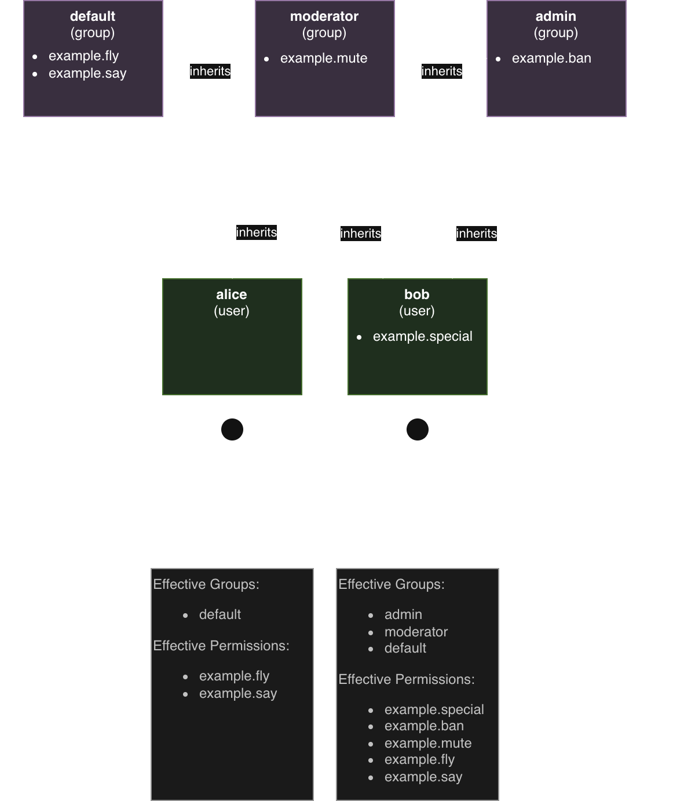

### Contents
* [Key Concepts](#key-concepts)
* [Getting Started](#getting-started)
  * [Granting full access to LuckPerms](#granting-full-access-to-luckperms)
  * [Creating the first group](#creating-the-first-group)
  * [Adding a user to a group](#adding-a-user-to-a-group)
  * [Making a group inherit another group](#making-a-group-inherit-another-group)
  * [Removing parent groups](#removing-parent-groups)
  * [Finding Permissions](#finding-permissions)
  * [Web Editor](#web-editor)

If you're already familiar with what LuckPerms is and what it does, then feel free to skip directly to the [Command Usage and Permissions](Command-Usage) section, which is more of a quick reference.

Otherwise, read on! To start with, let's go over some key concepts...

# Key Concepts
### Permission
On your server, there will be certain **features, commands, and functionality** which exist. Some of these features will be included with the server, and others are added with "plugins" or "mods". Most of these actions **have a permission associated with them**, so you can control which users have access to each feature or command.

A **permission is just a string** (a sequence of letters/digits), and is separated into parts using periods. For example, “minecraft.command.ban” is the permission for Minecraft's /ban command.

The string that represents a certain permission is also sometimes called a "permission node" or just "node" for short.

Permission nodes can have **three values**: `true`, `false`, and `undefined`.
- `true` means that the player *has that permission* and the condition(s) assigned to it will be given to the player.
- `false` means that the player *does not have that permission* and the condition(s) assigned to it will be *denied* to the player.
- `undefined` means that the permission is *not explicitly set* in LuckPerms. This **usually** means that it defaults to being the same as `false`. Very rarely, plugins can make `undefined` permissions default to `true`, in which case you need to **set them explicitly to `false`**. 

### Group
Instead of assigning permissions to every user individually, we have **groups of permissions**, which can then be **assigned to a user** as a whole.

For example, in my "admin" group, I might add permission to use the /ban and /unban commands, and then assign users to the admin group. This means that they will get all of the permissions from "admin", plus any they have themselves.

### Inheritance
Users and groups are able to **inherit permissions from each other**. For example, by default, all users inherit permissions from the "**default**" group. You can setup your own groups and inheritances for your server, and make your own unique system.

For example, I might have 3 groups, "default", "moderator" and "admin". I want moderator to inherit permissions from default, and admin to inherit permissions from moderator.

In the example above, the user "Bob" inherits from the "admin" group, which in turn inherits from "moderator" and so on. In LuckPerms, when a user/group inherits from another group, we call that group a "**parent**" group.

### Context
A term that you will encounter quite often with LuckPerms is "context".

**Context** in the most basic sense simply means the **circumstances where something will apply**. For example, contexts allow you to grant users or groups permisions that only apply in certain servers, worlds, gamemodes, etc.

Contexts are such a fundamental part of the plugin, they have their [very own wiki page](Context) dedicated to explaining their use. :)

# Getting Started
If you haven't got LuckPerms installed just yet, please refer to the [installation guide](Installation) first.

Then, please make sure you read the section about [choosing a Storage type](Storage-types) before proceeding. Whilst it is possible to change these options later, it's better to get them right the first time around.

## Granting full access to LuckPerms
The first thing you'll want to do is give yourself full access to the plugin. When LuckPerms is first installed, nobody has access to any of the LP commands.

To do this, login to your server, and then open the server console.

Then, type `lp user <your username> permission set luckperms.* true`. (don't worry, the usage of this command will be explained later)

The result should look something like this:   

> If you're running an "integrated server" (the server is running inside your game client), you might not have a console to access, but that's ok! You should automatically have all permissions already.

Effectively, what we've done there is give your user the `luckperms.*` permission. (or sets it to true for the user) You'll notice there's a `*` character at the end of the permission string. This character is called a wildcard, and gives a user access to **all** permissions which start with "luckperms".

Now you've done this, you can either continue the setup process in-game, or keep typing commands into the console.

## Creating the first group
You can create a new group with the creategroup command. Let's create a new group called admin, and then give it a permission.

First, run `lp creategroup admin`. This will create a new empty group named "admin".

Next, we want to add a permission to the admin group. The command to modify a group is `lp group <group>`. If you run the command, it will list each of the subcommands back to you.

Since we want to add a permission, the subcommand we want is "permission". This allows you to modify the permissions held by the group. Again, running `lp group admin permission` will list the available sub-commands.

Again, we see more commands we can use. The first is another "info" command. Since it's a sub command of "permission", this info command returns information about the permissions a group has. The next command however is the "set" command.

Remember, we used this earlier to give a user access to the "luckperms.*" permission. It works the same here.

Just running the command without any arguments will return information about how to use it. For example:    

For example, I want to give my admin group access to "minecraft.command.ban". I can therefore just run `lp group admin permission set minecraft.command.ban true`.

This command is giving `admin` access to the `minecraft.command.ban` permission. The true at the end is the value we're assigning the permission as. You can either set a permission to `true` or `false`. Setting a permission as true gives the user or group access to it, and setting it to false negates it. (specifically doesn't give them access)

If I decide later that I don't want admin to have this permission anymore, I can just use the unset command to remove it, with `lp group admin permission unset minecraft.command.ban`.

> The `minecraft.command.ban` permission is just an example, and if you're using a different platform (e.g. not a Minecraft server), the permission for the ban command will be different, but the concept is the same!

## Adding a user to a group
Adding users to a group can be done with the "parent" command. (we just swap "permission" for "parent" in our command usage)

For example, to add myself to the admin group, I would run `lp user Luck parent add admin`.

This command adds the user `Luck` to the `admin` group. This means that any permissions admin has, I also have through inheritance.

## Making a group inherit another group
As well as users, groups are also able to inherit other groups.

For example, suppose the following setup. (the permissions are not real, just examples)

| Admin       | Mod          | Default     |
|-------------|--------------|-------------|
| example.ban | example.mute | example.fly |
|             |              | example.say |

I want users in my `admin` group to also have access to `mod` and `default` permissions, and I want users in the `mod` group to have access to `default`'s permissions.

To achieve this, I can setup the groups to inherit from each other.

The command `lp group admin parent add mod` will make admin inherit all of moderator's permissions. I can then do the same for mod, and run `lp group mod parent add default`.

The inheritance is recursive, so since although admin how only inherits directly from mod, mod inherits from default. This means admin has access to both the permissions in mod **and** default.

## Removing parent groups
Removing parent groups is done with a spookily similar command.

To remove myself from admin, I'd just run `lp user Luck parent remove admin`.

## Finding permissions

So far we have just been using made-up example permissions, but on your server, you'll want to use ones that actually relate to some functionality or ability, like a command.

There's a couple of ways to find out what these are:

* Look at **documentation** for your game server software
* Look at **documentation** for your other plugins/mods
* Use the **[`/lp verbose`](Verbose)** command!
* Use **auto-complete** (either in commands or web editor)
    * Note: The auto-complete list is not exhaustive! It is just the permissions LuckPerms has "seen" since the server started. If a permission isn't listed, you can still use it.

### Verbose command

The [Verbose](Verbose) command allows you (as the server admin) to monitor permission checks occurring in real time! This is the most reliable way to find permissions (and figure out why they aren't working as intended).

Simplest usage:

* Run `/lp verbose record <test user>` where `<test user>` is the name of the user who will run the command
* Get the test user to run the command
* Run `/lp verbose paste` to turn verbose mode off and generate a report of the permissions that were checked
* Check the output to see which permissions were checked.

Example:

You can also use `/lp verbose on <test user>` to simply print the output to the chat/console, and `/lp verbose off` to turn it off after you're done. 

More advanced usage is documented on the Verbose [wiki page](Verbose).

## Web Editor

Are commands too much typing for you?! LuckPerms has a fancy online [Web Editor](Web-Editor) which allows you to edit your permissions setup easily in an interactive web page.

Just run `/lp editor` and follow the link to get started.

More information can be found on this [wiki page](Web-Editor).
